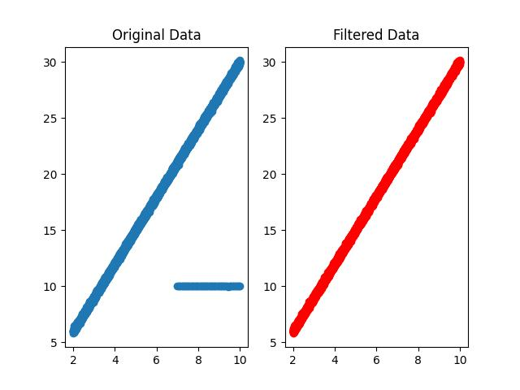

# RANSAC Algorithm for Linear Model Fitting

This repository contains a Python implementation of the Random Sample Consensus (RANSAC) algorithm, designed specifically for linear model fitting. The RANSAC algorithm is a robust method used to fit mathematical models from data sets that may contain outliers.




## Features

- **Robust Linear Fitting**: Implements the RANSAC algorithm to robustly fit lines to noisy data with outliers.
- **Customizable Parameters**: Allows tweaking of key RANSAC parameters like the number of iterations, inlier threshold, and minimum number of good points.
- **Example Usage**: Includes an example script that demonstrates how to use the RANSAC algorithm on synthetic data.

## Repository Structure

- `ransac.py`: The core implementation of the RANSAC algorithm along with helper functions for model fitting and error calculation.
- `implementing_ransac.py`: A script that uses the RANSAC algorithm from `ransac.py` to fit a model to synthetic data.
- `README.md`: This file, providing an overview and instructions for using the repository.

## Getting Started

### Prerequisites

You will need Python installed on your system. The code has been tested with Python 3.8. Additionally, you will need the numpy library for numerical operations:

```bash
pip install numpy
